# RTL Coding and Functional Verification

A comprehensive portfolio of **RTL digital designs** and their **functional verification environments**, covering both SystemVerilog-based testbenches and UVM (Universal Verification Methodology) testbenches. This repository demonstrates end-to-end skills in digital design and verification — from RTL implementation to self-checking testbench architecture.

---

## About This Repository

This collection was built as part of the **Verification Series by Kumar Khandagle (Udemy)**, a structured curriculum covering:
- **RTL Design** — Bus protocols, memory interfaces, standard peripherals
- **SystemVerilog Testbench Architecture** — Interface-driven TBs, constrained-random stimulus, functional coverage
- **UVM Methodology** — Agents, drivers, monitors, scoreboards, sequences, and test classes

The course series provides hands-on training in **RTL design and functional verification** using industry-standard languages and methodologies.

---

RTL_Coding_FunctionalVerification/
├── rtl_coding_sv_tb/          # RTL designs + SystemVerilog testbenches
│   ├── ahb.v / ahb_tb.sv
│   ├── apb.v / apb_tb.sv
│   ├── axilite_s.v / axilite_s_tb.sv / axilite_sv_tb.sv
│   ├── i2c.v / i2c_tb.sv
│   ├── spi.v / tb_code_spi.sv / v_tb_spi.sv
│   ├── uart.v / uart_tb.sv
│   └── whishbone.v / whishbone_tb.sv
├── rtl_coding_uvm_tb/         # RTL designs + UVM testbenches
│   ├── apb_ram.sv / apb_ram_uvm_tb.sv
│   ├── axi_memory.sv / axi_memory_uvm_tb.sv
│   ├── dff.sv / dff_uvm_tb.sv
│   ├── i2c_mem.sv / i2c_mem_uvm_tb.sv
│   ├── mul.sv / mul_uvm_tb.sv
│   ├── spi_mem.sv / spi_mem_uvm_tb.sv
│   ├── tlm_fifo.sv / tlm_fifo_uvm_tb.sv
│   └── uart.sv / uart_uvm_tb.sv
└── verificaiton/              # Course completion certificates & credentials

---

## RTL Designs with SystemVerilog TBs (`rtl_coding_sv_tb/`)

| Design | Description | Testbench Features |
|--------|-------------|-------------------|
| **AHB** | AMBA AHB slave with burst/transfer support | SV interface, protocol checking, waveform validation |
| **APB** | AMBA APB slave for low-power peripheral access | Register read/write tests, PENABLE/PSLVERR checks |
| **AXI4-Lite Slave** | Lightweight AXI slave for control register access | Address decode, write strobes, response channels |
| **I2C** | I2C master with START/STOP/ACK handling | Clock stretching, bidirectional SDA, timing checks |
| **SPI** | SPI master with CPOL/CPHA modes | MOSI/MISO loopback, CSn generation, mode verification |
| **UART** | 8N1 UART transmitter/receiver | Baud-rate generation, frame error detection, loopback test |
| **Wishbone** | Wishbone B4 compatible slave | Classic/registered cycles, retry/termination logic |

---

## RTL Designs with UVM Testbenches (`rtl_coding_uvm_tb/`)

| Design | UVM Components Demonstrated |
|--------|---------------------------|
| **APB RAM** | UVM agent (driver/monitor/sequencer), memory scoreboard, constrained-random transactions |
| **AXI Memory** | AXI protocol agent, read/write sequences, out-of-order response handling |
| **D Flip-Flop** | Basic UVM environment, sequence library, phase callbacks |
| **I2C Memory** | I2C bus agent, EEPROM-style memory model, multi-byte transaction sequences |
| **Multiplier** | Signed/unsigned constrained-random stimulus, result checker, coverage collection |
| **SPI Memory** | SPI flash-style memory interface, command sequences, status register polling |
| **TLM FIFO** | TLM ports/exports, producer-consumer sequences, backpressure testing |
| **UART** | Configurable baud-rate sequences, framing error injection, parity checking |

---

## Course Credentials — Verification Series (Kumar Khandagle, Udemy)

The following certificates and learning artifacts are included in the `verificaiton/` directory:

| Certificate | Topic Covered |
|-------------|--------------|
| 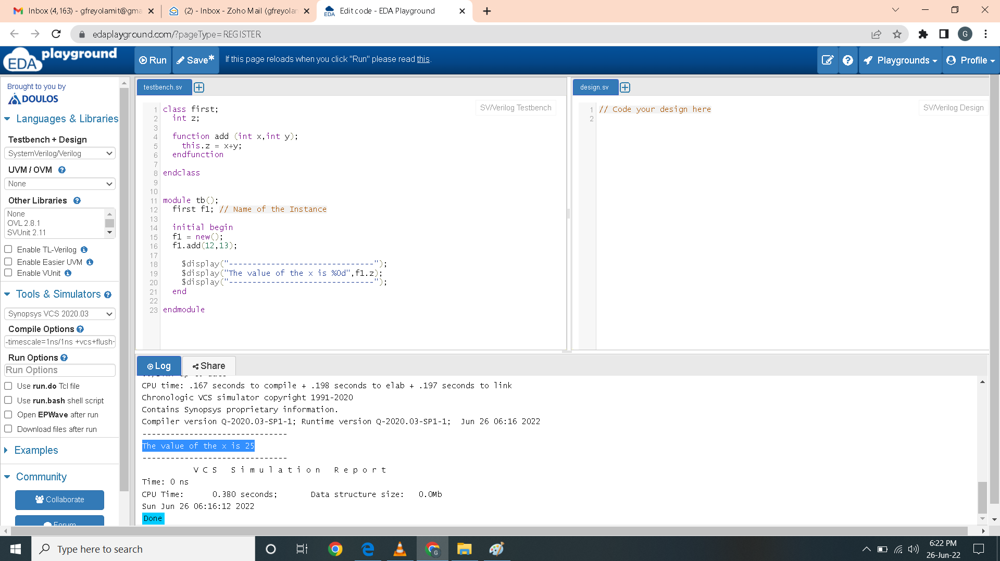 | SystemVerilog for Verification — data types, OOP, interfaces, constrained randomization, coverage |
| 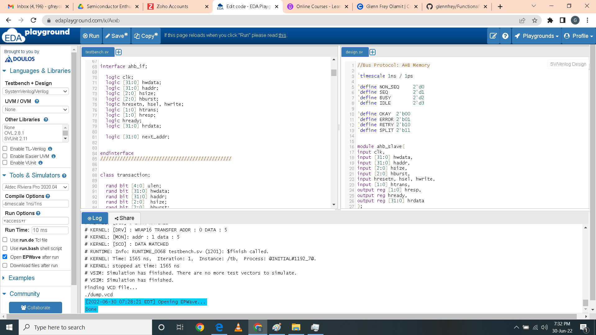 | AHB Protocol — burst transfers, bus arbitration, slave response |
| 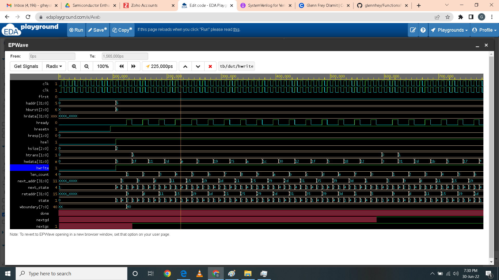 | AHB Timing — address phase, data phase, wait states |
| 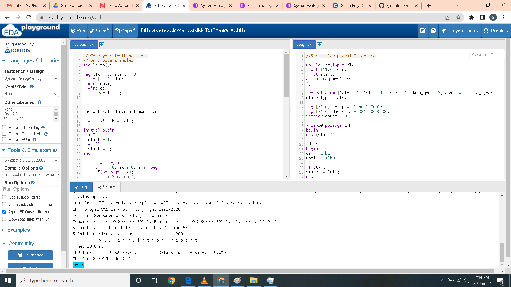 | SPI Protocol — clock polarity/phase, frame format, slave select |
| 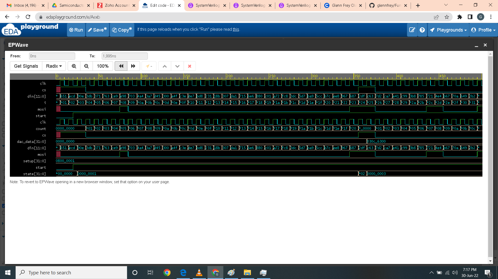 | SPI Timing — MOSI/MISO sampling, CSn assertion |
| 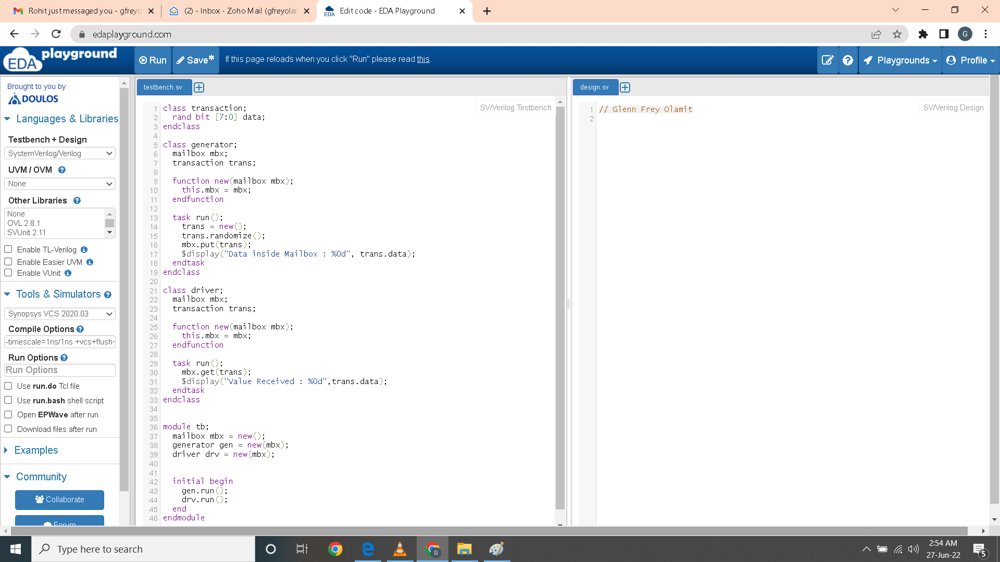 | SystemVerilog Testbench Architecture — module/class-based TBs, stimulus generation |
|  | Advanced SV TB — mailboxes, events, semaphores, IPC |
| 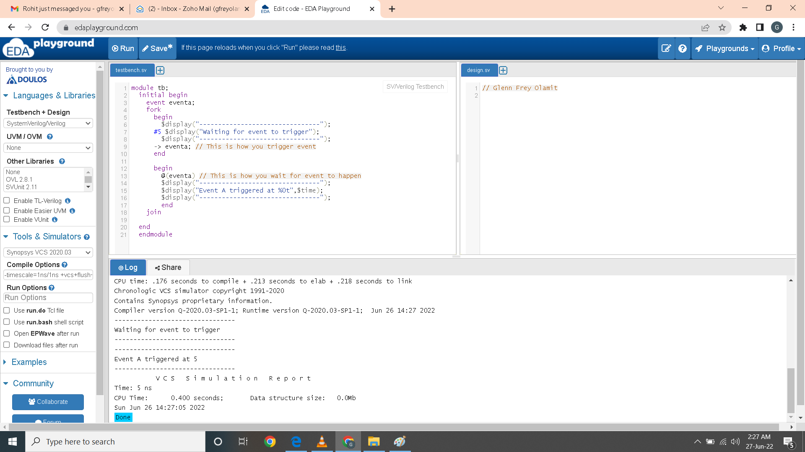 | Inter-Process Communication — events, callbacks, process control |
| 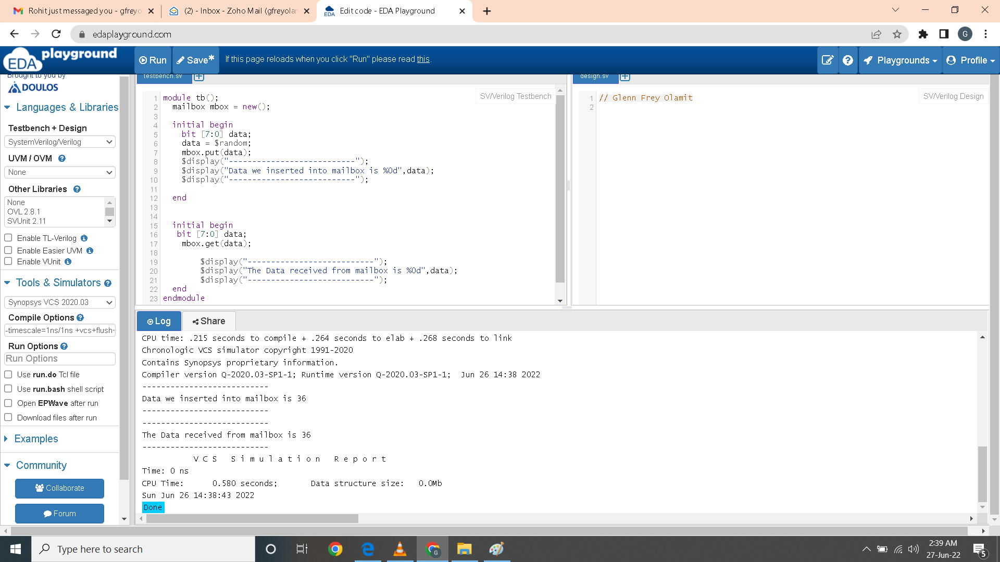 | Mailbox Communication — thread-safe data passing between TB components |
| 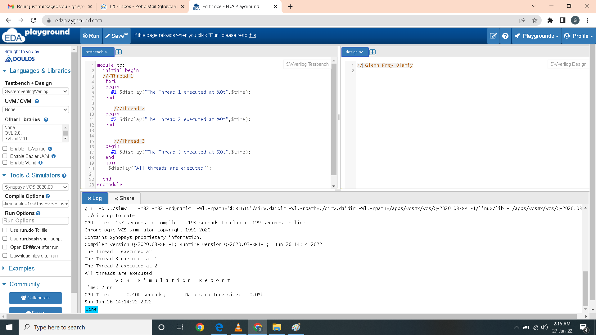 | Multi-threading — fork/join, disable fork, process synchronization |
| 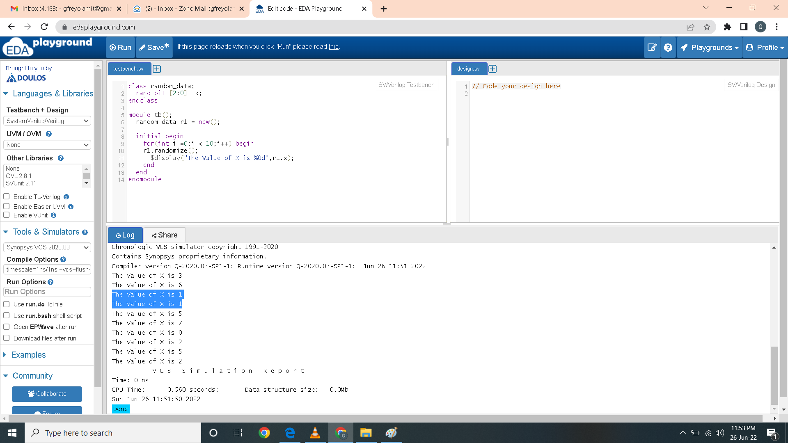 | Randomization — `rand`, `randc`, constraint blocks, inline constraints |
| 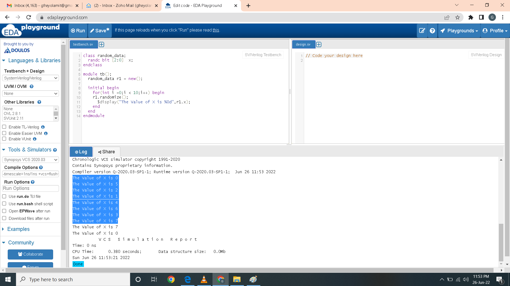 | Cyclic Randomization — `randc` for non-repeating value generation |
|  | System Randomization — `$random`, `$urandom_range`, distribution control |
| 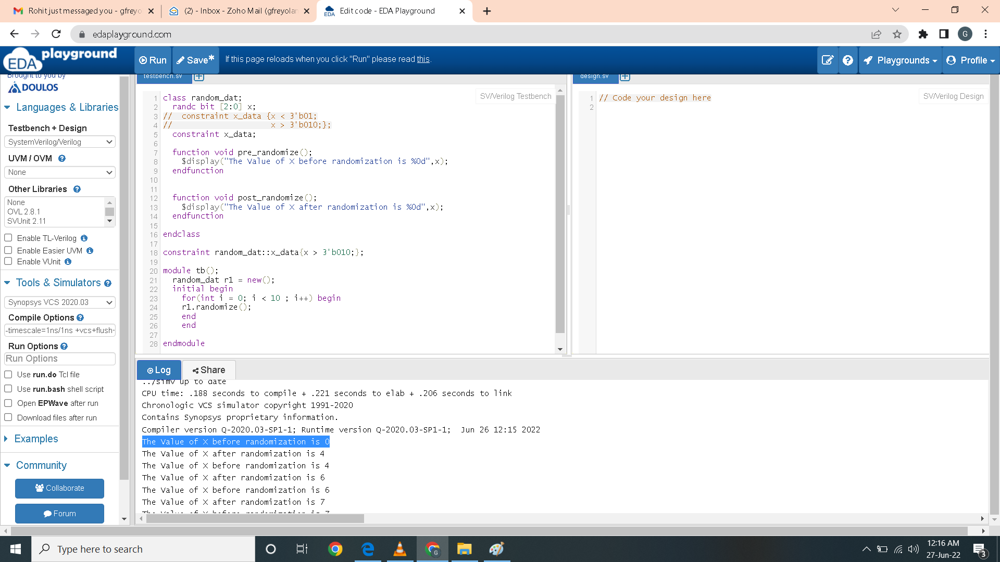 | Pre/Post Randomization — `pre_randomize()`, `post_randomize()` hooks |
|  | Professional credential sharing |
|  | Course completion verification |

---

## Tools & Methodologies

| Category | Tools / Standards |
|----------|------------------|
| **RTL Design** | Verilog-2001, SystemVerilog-2012 |
| **Simulation** | Icarus Verilog, EDA Playground, Synopsys VCS (server) |
| **Verification** | SystemVerilog Assertions (SVA), Self-checking testbenches |
| **UVM** | UVM 1.1d / 1.2 class library |
| **Coverage** | Functional coverage, code coverage |
| **Protocols** | AHB, APB, AXI4-Lite, I2C, SPI, UART, Wishbone |

---

## How to Run

### SystemVerilog Testbenches (Icarus Verilog)
```bash
cd rtl_coding_sv_tb
iverilog -g2012 -o sim.vvp uart.v uart_tb.sv
vvp sim.vvp
**
### UVM Testbenches (requires UVM library + simulator)
**
cd rtl_coding_uvm_tb
# Example with Synopsys VCS
vcs -sverilog -ntb_opts uvm-1.2 -f filelist.f -o simv
./simv


## Repository Structure
Functional Verification example code view and waveform


## Skills Demonstrated
RTL Design: Synchronous digital design, bus protocol implementation, state machines, datapath/control logic
SystemVerilog TB Architecture: Interface-driven testbenches, constrained-random stimulus generation, functional coverage modeling
UVM Methodology: Agent/driver/monitor/scoreboard hierarchy, sequence-library architecture, test configuration, TLM communication
Protocol Verification: AMBA (AHB/APB/AXI), I2C, SPI, UART, Wishbone — protocol compliance checking and error injection
Debug & Analysis: Waveform analysis, assertion-based checking, self-checking scoreboards


